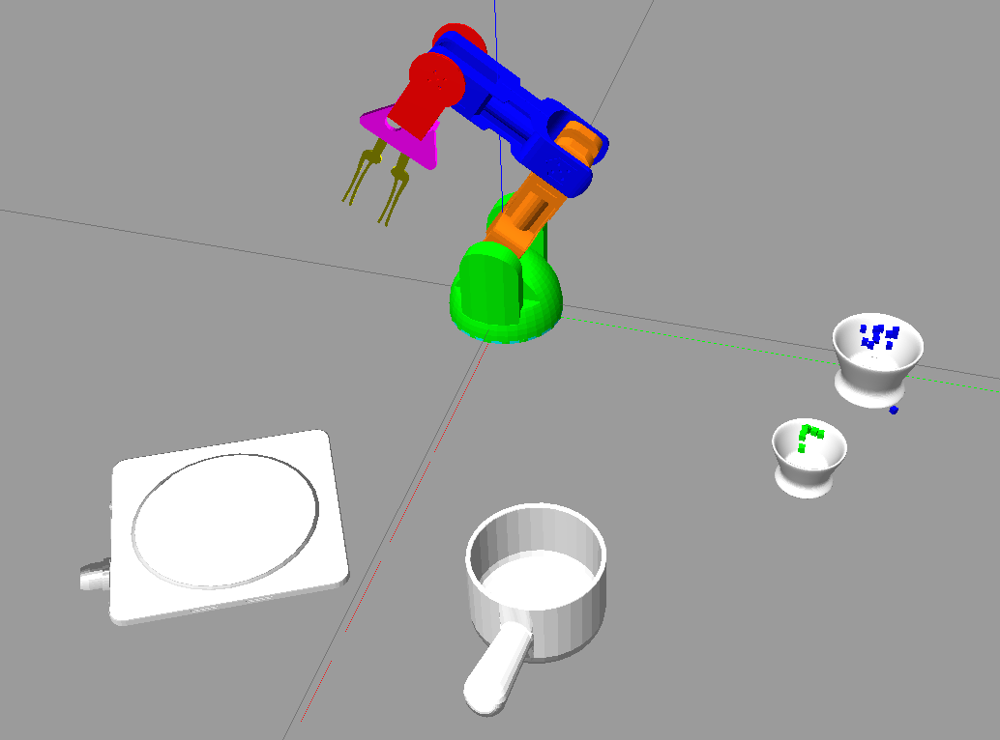

# Braccio Pick+Drop Simulation with ROS MoveIt and Gazebo

This is a package with a standalone simulation of a Braccio arm with a block, ramp and bowl.  The robot arm picks the red block both from above or from the side, depending on position, and delivers the block to the blue bowl. The arm can then lift and relocate the bowl with the block in it.


The package comes with a command line interface to control the simulated arm.

## Installation

### Prequisities
*  Tested on ROS MELODIC
*  Required Packages:
```
sudo apt-get install ros-melodic-gazebo-ros-pkg
sudo apt-get install ros-melodic-gazebo-ros-control
sudo apt-get install ros-melodic-moveit
```

### Download and build source
```
mkdir braccio_arm_ws
cd braccio_arm_ws
mkdir src
cd src
git clone git@github.com:lots-of-things/braccio_moveit_gazebo.git
cd ..
catkin_make
```

## Usage

### Launch the programs

Start up two bash terminal sessions and navigate to the workspace directory (`braccio_arm_ws` above).

In the first terminal run the following to bring up the Gazebo simulation.
```
source devel/setup.bash
roslaunch braccio_moveit_gazebo rviz_connected_with_gz_using_moveit.launch
```

Gazebo should open with a scene that contains the robot and the items.  You may need to reposition the display camera to see everything.



In the second terminal run this to bring up the command line control interface
```
source devel/setup.bash
rosrun braccio_moveit_gazebo target_object_sim.py
```

You should see the following splash screen after a few seconds


### Using the control interface
After you've launched the program a menu will pop up with options to

Hopefully the commands are pretty self-explanatory.
```
==================== Instructions: ====================
c = calibrate, rerun calibration routine
t = target, pick up red block and drop on the ramp
m = manual, manually enter location for pickup
b = bowl, go through the preprogrammed bowl move
r = reset_target, set block to new location, reset bowl
q = quit program
```

Importantly, if you press `t` or `m` you'll be further prompted for whether you want to try to pickup from above or from the side.  The script will make a best attempt to find a suitable combination of joint positions to perform a pickup.  If that isn't possible, it'll attempt to push the object into position. If that isn't possible it'll just abort with a prompt.

To reset, press `r` and then insert the (x, y) position for the red block to be reset to.  The robot can reach within a radius of about 0.4 from the origin (0,0), though the accessible .

## Learn more

I've written up a more elaborate [blog post](#), that explains the internals in more detail. It covers the inverse kinematics solution, Gazebo+Moveit URDF setup, and Gazebo physics engine fine-tuning.

This project is a subtask in the creation of my [`su_chef` project](https://bonkerfield.org/su_chef/), an open-source, automated food prep assistant.

## Contact

If you have any questions, suggestions, or are just interested in reaching out, feel free to contact me [on Twitter](https://twitter.com/bonkerfield). For bugs, you can file [an issue](https://github.com/lots-of-things/braccio_moveit_gazebo/issues) and I'll take a look.

## Credits

I based this work off a lot of other things I found. I started with [CesMak/kuka_arm](https://github.com/CesMak/kuka_arm) ROS+gazebo project, but had to make a lot of adaptations to make it work with the Braccio arm.  I found this [braccio-study](https://github.com/dpakshimpo/braccio-study) repo as well, which reused the [braccio_arduino_ros_rviz](https://github.com/ohlr/braccio_arduino_ros_rviz) configuration, but didn't seem to run for me. Also, I couldn't use these packages alone, because I wanted to control using the MoveIt's python interface.

Next, I followed the [tutorial](http://docs.ros.org/melodic/api/moveit_tutorials/html/index.html) for setting up MoveIt! with gazebo.  It turned out I need two slightly different versions of I kept running into the problem that the physics were really jerky. Finally, I found a solution on these ROS Answers posts ([1](https://answers.ros.org/question/291228/simple-box-grasping-fails/) [2](https://answers.gazebosim.org//question/22353/how-to-connect-the-moveit-planning-with-gazebo-simulation/)) that suggested I need to switch everything to effort_controllers.  Guided by these repos ([1](https://github.com/jonabalzer/braccio_moveit_config),[2](https://github.com/berkeleyopenarms/blue_moveit),[3]((https://github.com/kkumpa/ros-robotic-arm))), I figured out how to implement effort_controllers and getthem working with MoveIt. This ended up solving a lot.  Finally, I tweaked physics parameters a lot to dial in good reactions, again based on many many ROS answers posts.