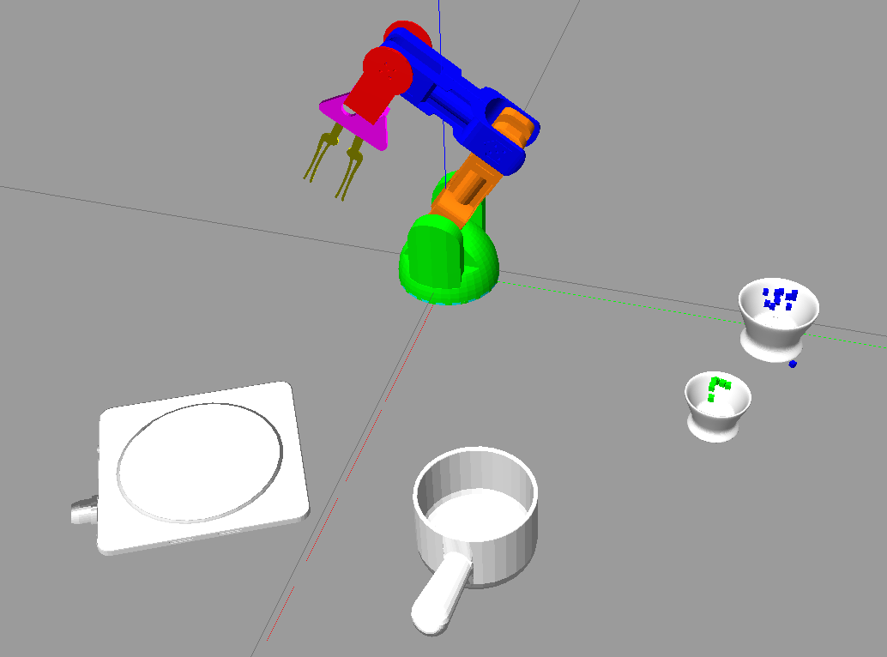

# Cooking Robot Arm

This is a package with a standalone simulation of a Braccio arm that performs a tea-making routine. The involved objects can be flexibly changed in Gazebo and the routine will still work (however, cannot guarantee drinkable tea at the end of it when positions are changed).

The package comes with a command line interface to control the simulated arm.

## Installation

### Prequisities
*  Tested on ROS MELODIC
*  Required Packages:
```
sudo apt-get install ros-melodic-gazebo-ros-pkg
sudo apt-get install ros-melodic-gazebo-ros-control
sudo apt-get install ros-melodic-moveit
```

### Download and build source
```
mkdir cooking_robot
cd cooking_robot
mkdir src
cd src
git clone https://github.com/riotonzuk/cooking_robot.git
cd ..
catkin_make
```

## Usage

### Launch the programs

Start up two bash terminal sessions and navigate to the workspace directory (`braccio_arm_ws` above).

In the first terminal run the following to bring up the Gazebo simulation.
```
source devel/setup.bash
roslaunch cooking_robot rviz_connected_with_gz_using_moveit.launch
```

Gazebo should open with a scene that contains the robot and the items.  You may need to reposition the display camera to see everything.



In the second terminal run this to bring up the command line control interface
```
source devel/setup.bash
rosrun braccio_moveit_gazebo target_object_sim.py
```


### Using the control interface
After you've launched the program a menu will pop up with options to

Hopefully the commands are pretty self-explanatory.
```
==================== Instructions: ====================
c = calibrate, rerun calibration routine
t = target, pick up red block and drop on the ramp
q = quit program
```

The script will make a best attempt to find a suitable combination of joint positions to perform the routine.  If that isn't possible, it'll attempt to push the object into position. If that isn't possible it'll just abort with a prompt.

## Credits

[lots-of-things/braccio-moveit-gazebo](https://github.com/lots-of-things/braccio_moveit_gazebo) for a solid base of a working robot arm that picks / places things.
