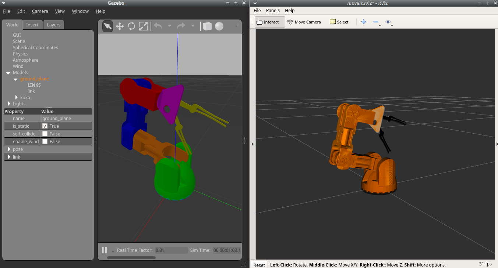

# Prequisities
*  Tested on ROS MELODIC
*  Required Packages:
```
sudo apt-get install ros-melodic-gazebo-ros-pkg
sudo apt-get install ros-melodic-gazebo-ros-control
sudo apt-get install ros-melodic-moveit
```

# Installation
* mkdir kuka_arm
* cd kuka_arm
* mkdir src
* cd src
* git clone git@github.com:lots-of-things/braccio_moveit_gazebo.git
* cd ..
* catkin init
* catkin build
* source devel/setup.bash

# Bring up in RVIZ and change joints


## Moveit
* Connect Gazebo Simulation to MoveIt

```
roslaunch braccio_moveit_gazebo rviz_connected_with_gz_using_moveit.launch
```


